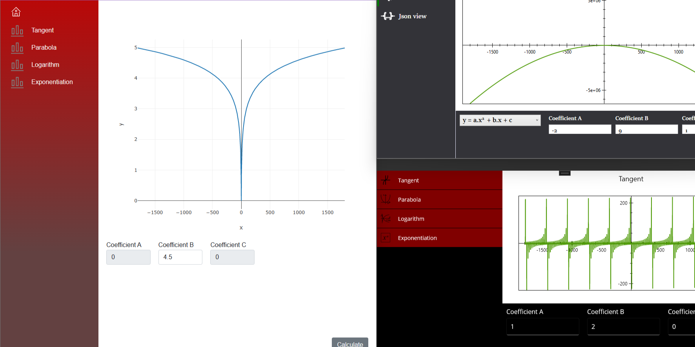
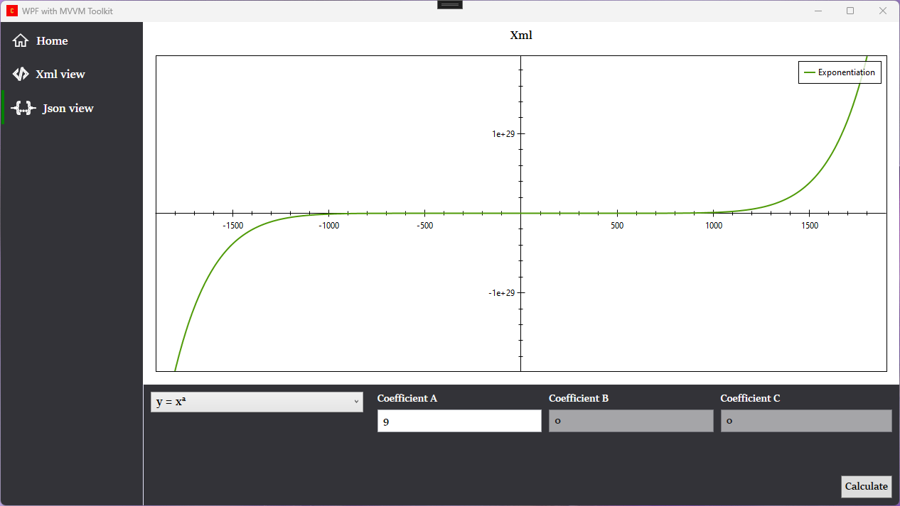
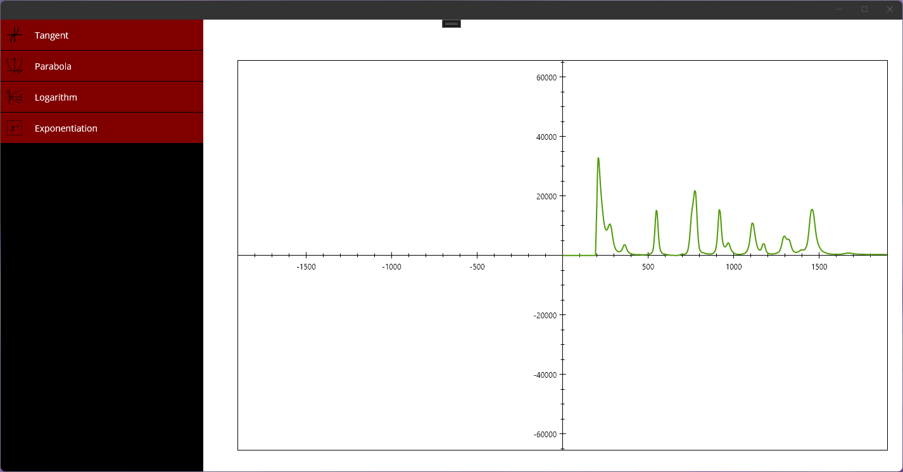
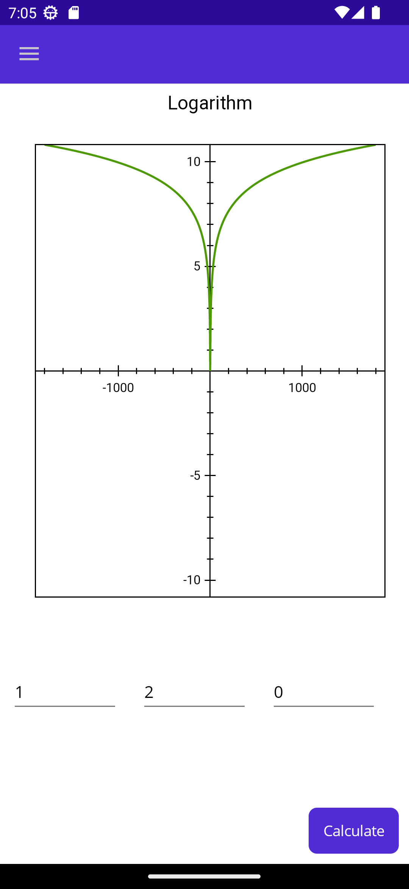
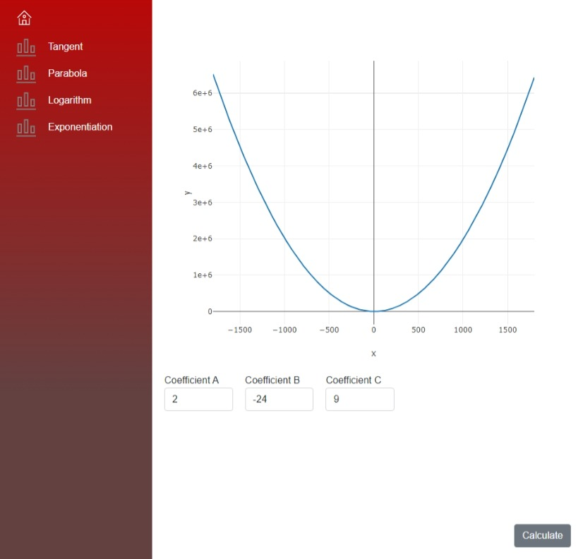

## Demo

My first Project was a Silverlight application, we used Entity Framwork, Prism, WCF and Design Pattern. I always have been deeping my knowledge in Design Pattern and Softwarearchitect since. I used to develop with Prism, and EF, because the most Project were in WPF. For about three years I have not developed any thing with WPF. I've been working with Web application (Blazor-Server) and missing a little bit working with WPF.

There are so much Changes, Improvement like .NET 6, .NET 7, Blazor, MAUI and DependencyInjection from Microsoft. I was wondering, how did it work without using Prism. (Prism suppports WPF, MAUI, Xamarin, but not Web application) and how did it work when I just used Libraries or Framework, which just come from Microsoft. That's why, I have made this Demo, just to see, how it works. 

#### Demo Core Layer holds the business model, which includes:
- A Point class.
- A Point repository.
- A IPointService, to get Point-list from Repository.
- A IMathSercive to calculate point list.
 
#### The Infrastructure projects contain the implementations of Repository (different imlemetations for json, xml or EF Core), of Service...etc.
#### The user interface layer are the entry point for the application (WPF, MAUI, Web)

Applied Technologies: 
- Clean Architecture
- .NET Standard 2.0 for Core project. It contains Entities classes, Interface and Service, the other Project use this Library project.
- .NET 7.0 for Infrastructure, which implements Core.
- MVVM Toolkit, Microsoft ServiceCollection
- NLog, OxyPlot, Plotly for Logging and Plotting.
- WPF, MAUI, Blazor Server.
## WPF

It is modular built. Json module and Xml module, each of them implements different logic (for instance, get data from xml, json, or different implementation for calculate from MathServer, just to demonstrate) and has own Views. The Main Page of Application is just a Shell, where all the module are put together. It is easy to extend and maintain. With Prism it is better to implement, but with ServiceCollection it works quite well.
### MAUI

 

There is just one View for both Plattform Adroind, UWP. They are using the common Shared project, with the same Controls and the Logic's implementations.
## Blazor

There are UI App and Share projects. The shared project holds the Controls, so it is reuseable. The UI is a Blazor Server, if it is nessessary, it can be extended with API app. 
